# Hi, I'm Ganesh.

I'm a **Software Engineer** with **5+ years of experience** building scalable, production-grade systems, primarily in the **fintech** and **cloud-native** domains. I specialize in **Python**, **Java**, **React**, **SQL**, and **AWS**. I have a strong foundation in **full-stack development**, **workflow automation**, and **data engineering**, with a focus on **building systems that drive measurable business impact**.

### 🚀 About Me

- **End-to-End Expertise**: I can deploy an MVP in hours using **GenAI tools**, and have hands-on experience with **data ingestion pipelines** and **ETL processes**.
- **AI & Research**: Recently, I’ve trained **vision transformers** like **SWIN**, **Segformer**, and **LaneATT** on **event-based camera data** for **high-accuracy road lane detection**—outperforming traditional methods.
- **Robotics & Autonomous Systems**: Currently, I'm a **Research Assistant** at the **UTA Research Institute**, developing real-time perception and motion tracking systems for autonomous platforms using **sensor fusion** and **event-based vision**.
- **Passion**: I enjoy solving complex problems, optimizing code, and building prototypes that just work. I'm driven by a desire to create smarter, more efficient tools that have a meaningful impact.

### 🚀 Deployed Projects

Here are a couple of my deployed projects:

---

### [LangFetch - AI SQL Copilot](https://langfetch-mvp.vercel.app/)

LangFetch is an AI-powered SQL Copilot that transforms natural language queries into optimized SQL. Built to demonstrate enterprise-grade AI engineering, it features real-time streaming agent responses, schema exploration, and query optimization suggestions. The frontend uses Next.js 14 with React 18 and Tailwind CSS for a Material Design 3 interface, while the backend leverages FastAPI with multi-agent orchestration via LangChain and LangGraph. AI capabilities are powered by Anthropic's Claude 3.5 Sonnet using function calling for structured outputs. The system orchestrates four specialized agents—Planner, Generator, Validator, and Explainer—that collaborate to break down queries, generate SQL, check syntax, and provide natural language explanations. Database schemas are embedded using Pinecone's vector store for intelligent context retrieval, while Neon PostgreSQL and Upstash Redis provide persistent storage and caching. A key architectural feature is the streaming response pipeline that makes agent reasoning visible to users, showing each step of the query generation process in real-time. The application is production-ready with responsive design, dark mode support, analytics tracking, and deployed on Vercel (frontend) and Railway (backend) for scalability across 100+ concurrent users.

---

### [FeatureLab - Autonomous ML Feature Engineering](https://featurelab-tan.vercel.app/)

FeatureLab is an AI-powered feature engineering agent that autonomously transforms raw datasets into high-signal feature sets optimized for CTR prediction. The project demonstrates production-grade agentic AI with real-time streaming of agent reasoning, feature exploration, and evidence-based keep/discard decisions.

The frontend is built with Next.js 16, React 18, and Tailwind CSS v4 to deliver a polished dark-mode dashboard, while the backend runs on FastAPI with an asynchronous agent loop. AI reasoning is powered by Google Gemini Flash using structured JSON outputs for transformation proposals and decision explanations.

The system follows a five-stage agent cycle—Observe, Hypothesize, Execute, Evaluate, Decide. It profiles features, proposes transformations, applies them, and evaluates signal using Mutual Information, Information Value, AUC, and LightGBM feature importance. Only features exceeding a 2% signal improvement threshold are retained.

Feature metadata is indexed in Pinecone’s vector database to enable cross-experiment intelligence retrieval, while Neon PostgreSQL provides persistent storage for experiments and feature artifacts. A key architectural component is the SSE streaming pipeline, which exposes the agent’s reasoning in real time by displaying each hypothesis, action, result, and decision.

The application includes an animated splash screen, responsive analytics dashboard, and is deployed in production on Vercel (frontend) and Render (backend).

<table>
  <tr>
    <td></td>
    <td></td>
  </tr>
</table>

---

### [Dental AI -- Automated YOLOv8 ML Retraining Pipeline](https://github.com/ganeshhgupta/ML-Retraining-Pipeline)

A production ML pipeline for automated dental disease detection with monthly model retraining. Patient images flow through quality validation, real-time YOLOv8 inference on SageMaker, expert dentist annotation, and automated blue-green deployment -- all orchestrated end-to-end on AWS. The ingestion layer uses Lambda and S3 with a quality gate checking blur, brightness, contrast, and resolution before storing metadata in DynamoDB. Inference is served via a SageMaker YOLOv8 endpoint scaling from 1 to 10 instances, with results routed through SQS and SNS. Verified annotations feed a monthly Step Functions pipeline that validates data, augments class imbalances using Albumentations, trains for 50 epochs on `ml.g4dn.xlarge`, and deploys only when the new model achieves at least +2% mAP improvement over production. HIPAA-compliant with KMS encryption, VPC-only endpoints, and CloudTrail audit logging -- handling 10,000+ inferences per day at under 5s P99 latency.

**Tech Stack:** AWS (SageMaker, Lambda, S3, DynamoDB, Step Functions, EventBridge, SQS, SNS, EC2, ALB, CloudWatch) -- YOLOv8 -- Albumentations -- FastAPI -- React -- Supabase -- Prisma ORM

```mermaid
flowchart LR

    subgraph EXT["Layer 1 -- External"]
        SUP["Supabase\nImage Storage"]
        PRIS["Prisma ORM\nApp DB"]
        APIGW["API Gateway\nPOST /upload"]
        SUP --> PRIS --> APIGW
    end

    subgraph ING["Layer 2 -- Ingestion and Quality"]
        LING["Lambda\nImage Ingestion"]
        S3["S3 Buckets\nraw / verified / augmented"]
        LQUAL["Lambda\nQuality Gate"]
        DDB["DynamoDB\nMetadata and State"]
        LING --> S3 --> LQUAL -->|"Pass"| DDB
    end

    subgraph INF["Layer 3 -- Inference"]
        SQS["SQS Queue\n+ Dead Letter Queue"]
        LBATCH["Lambda\nBatch Processor"]
        SM["SageMaker\nYOLOv8 Endpoint\n1 to 10 instances"]
        SNS["SNS Topic\nPrediction Complete"]
        SQS --> LBATCH --> SM --> SNS
    end

    subgraph ANN["Layer 4 -- Annotation"]
        ALB["ALB\nLoad Balancer"]
        EC2["EC2 App\nFastAPI + React"]
        LVAL["Lambda\nValidator"]
        SYNC["Supabase Sync\nUpdate JSON"]
        ALB --> EC2 --> LVAL --> SYNC
    end

    subgraph RET["Layer 5 -- Monthly Retraining"]
        EB["EventBridge\ncron 0 2 1 -- 2AM UTC"]
        SF["Step Functions\n8-Step Workflow"]
        S1["1. Validate\nMin 100 images"]
        S2["2. Class Analysis\nImbalance check"]
        S3B["3. Augment\nAlbumentations"]
        S4["4. Train\nYOLOv8 50 epochs"]
        S5["5. Evaluate\nmAP, Precision, Recall"]
        S6["6. Compare\n+2% threshold"]
        S7["7. Deploy\nBlue-green rollout"]
        S8["8. Register\nS3 + Model Registry"]
        EB --> SF --> S1 --> S2
        S2 -->|"Imbalanced"| S3B --> S4
        S2 -->|"Balanced"| S4
        S4 --> S5 --> S6
        S6 -->|"Improved"| S7 --> S8
        S6 -->|"No change"| S8
    end

    subgraph MON["Layer 6 -- Monitoring"]
        CW["CloudWatch\nAlarms"]
        ALERT["SNS Alerts\nOps Team"]
        CW --> ALERT
    end

    APIGW --> LING
    DDB -->|"Verified images"| SQS
    SNS --> ALB
    SYNC --> DDB
    DDB -->|"Monthly trigger"| EB
    SM --> CW
    SF --> CW
```

### [Everleaf - AI-based LaTeX editor](https://everleaf-app.vercel.app/)

Everleaf is an AI-native LaTeX editor built to simplify academic writing by automating formatting, citations, and content editing.It features real-time LaTeX compilation, PDF preview, and mobile-friendly editing. The frontend is built with React and Tailwind CSS, while the backend uses Node.js and Express. For AI capabilities, it integrates Meta’s Llama 3.1 via Groq API for fast, context-aware language generation. Uploaded documents are processed using LlamaParse, and their embeddings are stored in Pinecone for vector-based retrieval. A RAG pipeline powers the research assistant, enabling users to ask questions or insert references from their own uploaded papers. A key technical focus was enabling surgical editing of LaTeX—modifying targeted sections without breaking document structure.

---

### 🎥 **Event-Based Histogram of Gradients using Vision Transformers (ViT)**

**Vision Transformers** have revolutionized the field of computer vision by applying the **self-attention** mechanism to image recognition tasks. This project aims to enhance **ViT's** performance by incorporating **HOG (Histogram of Oriented Gradients)** features, which are known for their ability to capture shape and appearance information through gradient distributions.

**Thesis Link**: [Enhancing Vision Transformers with HOG Features](https://mavmatrix.uta.edu/cse_theses/527/)

### Energy-Aware Multi-Agent Reinforcement Learning for Digital Twin Networks

Developed a multi-agent deep RL system optimizing power allocation in wireless networks with digital twin technology. Implemented and benchmarked four MARL algorithms (VDN, MAPPO, MADDPG, adaptive scalarization) discovering on-policy methods achieve 18% energy savings while value decomposition fails with large action spaces. Scaled from 3 to 12 base stations proving 48% energy improvement (2.04 → 1.07 J/Mb) with linear throughput scaling across 12,000+ GPU hours. Addresses critical 5G/6G infrastructure energy consumption—work submitted to IEEE DySPAN 2026.

---

### [Employee Management with real-time Analytics: React, Node, PostgreSQL](https://employee-management-system-gzpb.vercel.app/)

A web-based portal for managing employee data with secure login and full CRUD operations along with real-time Dashboard Analytics. Built with React, Node, PostgreSQL, it enhances operational efficiency and boosts user engagement by 25%.

---

## 🛠️ Technologies Used

- **Languages**: Python, Java, JavaScript (React), SQL
- **Tech Stack**: React, Node.js, Express.js, MongoDB, PostgreSQL
- **Cloud/DevOps**: AWS (Certified), Docker, Kubernetes, Terraform
- **AI/Robotics**: LLMs, Vision Transformers, Sensor Fusion, Event-based Cameras

---

## 🌐 Connect with Me

- [LinkedIn](https://www.linkedin.com/in/ganeshhgupta)
- [Website](https://ganeshhgupta.github.io)
